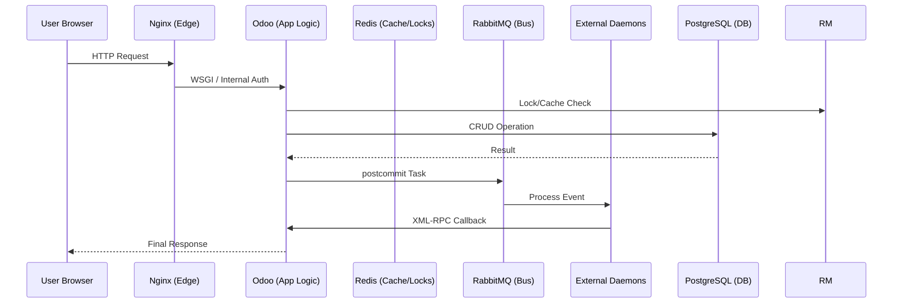

# Overarching Platform Integration Map

*Copyright © Bruce Perens K6BP. All Rights Reserved. This software is proprietary and confidential.*

This document maps the data flows, network boundaries, and daemon integrations for Hams.com. Read it to understand how our hybrid setup connects internal services to the outside world. [@ANCHOR: doc_integration_mermaid%]

---

## 1. Edge Ingress & Routing Layer (Nginx)
Nginx acts as our traffic cop. It splits standard web traffic from heavy data streams and mTLS handshakes.
* **`hams.com / www.hams.com" (Port 443):**
    * **`/" (Standard HTTP):** Routes to the Odoo WSGI web workers (`odoo:8069`) for standard CRM, Forum, and Logbook CRUD operations.
    * **`/websocket" (Odoo Bus):** Routes to Odoo's ASGI longpolling workers (`odoo:8072`) for standard UI state updates (e.g., notifications, chat).
    * **`/ws/firehose" (DX Cluster):** Bypasses Odoo entirely. Routes directly to the standalone `dx_firehose" Python daemon (`dx_firehose:8765`) for massive concurrent WebSocket connections.
* **`auth.hams.com" (Port 443 - Isolated):**
    * **mTLS Handshake:** Requires a valid `.p12` client certificate signed by the ARRL Root CA. Nginx verifies the cert, extracts the Subject DN (Callsign), and passes it securely to Odoo via internal HTTP headers (`X-Client-DN`).

---

## 2. The Core Data Triad
The central nervous system of the platform, completely isolated on the internal Docker network (`hams_internal`).
1.  **Odoo 19 (App Logic & ORM):** Executes business rules, Access Control Lists (ACLs), and the Zero-Sudo Service Account proxy methods. Serves the OWL frontend framework.
2.  **PostgreSQL 15 (Source of Truth):** Stores permanent records (`ham.qso`, `res.users`, `ham.dns.zone`). Emits `NOTIFY` events via database triggers for external listeners.
3.  **Redis 7 (Ephemeral Cache & Bus):** * Stores volatile state (e.g., DX Cluster spot history spanning 2-4 hours).
    * Acts as the distributed lock manager and idempotency cache for API rate-limiting.

---

## 3. The Asynchronous Daemon Ring
These standalone Python processes protect Odoo's web workers from memory bloat and I/O bottlenecks.

### A. Message Broker Integrations (RabbitMQ)
* **`adif_processor":** * *Trigger:* Odoo publishes a queue message when a user uploads an ADIF file.
    * *Action:* Daemon consumes the Base64 payload, parses thousands of QSOs, and writes them to PostgreSQL in bulk chunks.
* **`pdns_sync":**
    * *Trigger:* Odoo publishes a message when a `ham.dns.record" is modified.
    * *Action:* Daemon translates the Odoo record into PowerDNS queries and synchronizes the external authoritative DNS server.

### B. Real-Time Streaming (Asyncpg)
* **`dx_firehose":**
    * *Trigger:* Listens to the PostgreSQL `ham_qso_firehose" NOTIFY channel.
    * *Action:* Broadcasts JSON payloads directly to thousands of connected web browsers without consuming Odoo WSGI threads.

### C. External Polling Timers (Systemd / Cron)
* **`fcc_uls_sync":** Daily download of FCC EN/AM `.dat" files to update `ham.callbook".
* **`lotw_eqsl_sync":** Scheduled API polling of external QSL networks using user credentials.
* **`noaa_swpc_sync":** Hourly fetching of solar flux index (SFI) and K-Index metrics.

---

## 4. External Authority Integrations
We rely on external agencies to validate truth and enrich our data.
* **Identity & Onboarding:**
    * *ARRL LoTW:* Automated mTLS certificate validation (High Trust).
    * *FCC/ISED:* Official email lookup for OTP dispatches (Medium Trust).
    * *QRZ.com:* HTTP GET scraping for `HAMS-XXX" biometric tokens embedded in public bios.
* **QSL Confirmations:**
    * *ARRL LoTW API:* Outbound authenticated HTTPS requests to fetch `.adi" confirmation batches.
    * *eQSL.cc API:* Outbound authenticated HTTPS requests for digital QSL cards.
* **Client Hardware:**
    * *Hamlib / rigctld (`hams_local_relay.py"):* The OWL frontend makes `fetch()" requests to `http://127.0.0.1:8089", bridging the web browser to physical transceivers via local sockets.
* **Atmospheric & Propagation Forecasting:**
    * *NOAA SWPC / VOACAP:* Space weather telemetry is fetched via the `noaa_swpc_sync" daemon and utilized by the `ham_propagation" mathematical engine to calculate Maximum Usable Frequency (MUF) paths.

---

## 5. Tracing Key Data Flows

### Flow A: The Journey of a DX Spot (The Zero-DB Path)
1.  **Ingress:** Telnet node sends XML-RPC payload to `odoo:8069".
2.  **Memory Router:** `ham.dx.spot" AbstractModel validates the payload (No Postgres INSERT).
3.  **Cache:** Model executes `ZADD" to Redis for history.
4.  **Broadcast:** Model triggers `bus.bus" Notification.
5.  **Client:** OWL `dx_cluster_widget.js" intercepts bus message and updates DOM.

### Flow B: Local Hardware QSY (The Browser-to-Radio Path)
1.  **UI Action:** User clicks "QSY" on the Web Shack OWL component.
2.  **CORS Request:** JS fires a GET request to `http://127.0.0.1:8089/qsy?freq=14.074".
3.  **Local Relay:** The user's local `hams_local_relay.py" intercepts the request, validates CORS headers, and translates it.
4.  **Hardware Execution:** Relay opens a TCP socket to `127.0.0.1:4532" (rigctld) and issues the `F 14074000" command to tune the physical radio.
